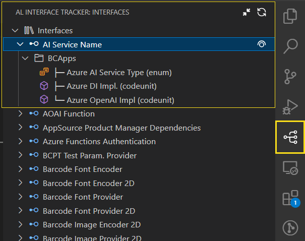
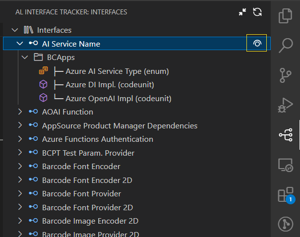
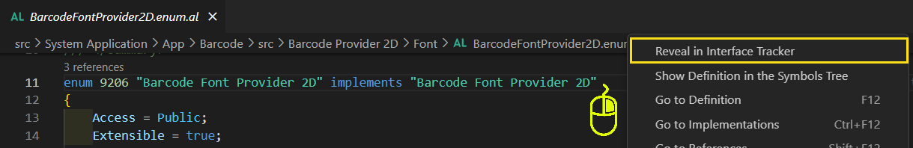

# AL Interface Tracker


> 🧠 Track and visualize interface definitions and implementations in AL projects for Microsoft Dynamics 365 Business Central.

---

## 🚀 Getting Started

1. Install the extension from the [Visual Studio Code Marketplace](https://marketplace.visualstudio.com/).
2. Open a Business Central AL project in VS Code.
3. Check the **"AL Interface Tracker"** view on the side explorer pane.
4. Open the Command Palette (`Ctrl+Shift+P` / `Cmd+Shift+P`).
5. Run: `AL: Search Interfaces`to look for a specific **"Interface"**.
6. Use **"Collapse All"** action to collapse the tree view.
7. Use **"Refresh"** action to update the view.
8. **"Unimplemented Interfaces"** are now marked with a ❗ for easy identification.
9. Right Click on the object to **"Reveal on the AL Interface Tracker**".

---

## 📂 Tree Structure

```
AL Interface Tracker
└── Interfaces
    ├── ICustomerHandler
    │   ├── App1
    │   │   ├─ MyHandler (codeunit)
    │   └── App2
    │       └─ ExtendedHandler (enum)
    └── IEmailService
        └── App1
            └─ EmailDispatcher (codeunit)
```
---

## ✨ Features

- 🔍 Detects and displays **interface definitions** across your AL workspace.
- 🧭 Lists all **implementations grouped by workspace folder**.
- 👁️ Navigate to the Interface Defination using **open interface**.
- 🧩 Recognizes **quoted** and **multiline interface**.
- 🧰 Convenient commands to **refresh** and **collapse** the tree.
- 📖 **Search Interface** definition without scolling the whole list.
- 🕵️‍♂️ Clean, modern UI with collapsible tree nodes.


---

## 📎 Requirements

- Visual Studio Code
- AL Language Extension (by Microsoft)
- Node.js (to build and debug the extension)

---

## 📸 Screenshots
### 🧭 Explore the view
> 

### 👁️ Open Interface
> 

### 🔍 Search Interface
> 

### 📌 Reveal Interface
> 
---

## 🤝 Contributing

Contributions are welcome! Please:

- Open issues for bugs or ideas.
- Submit PRs to enhance the extension.

---

## 📃 License

This project is licensed under the [MIT License].

---

Built with ❤️ for Business Central developers.
